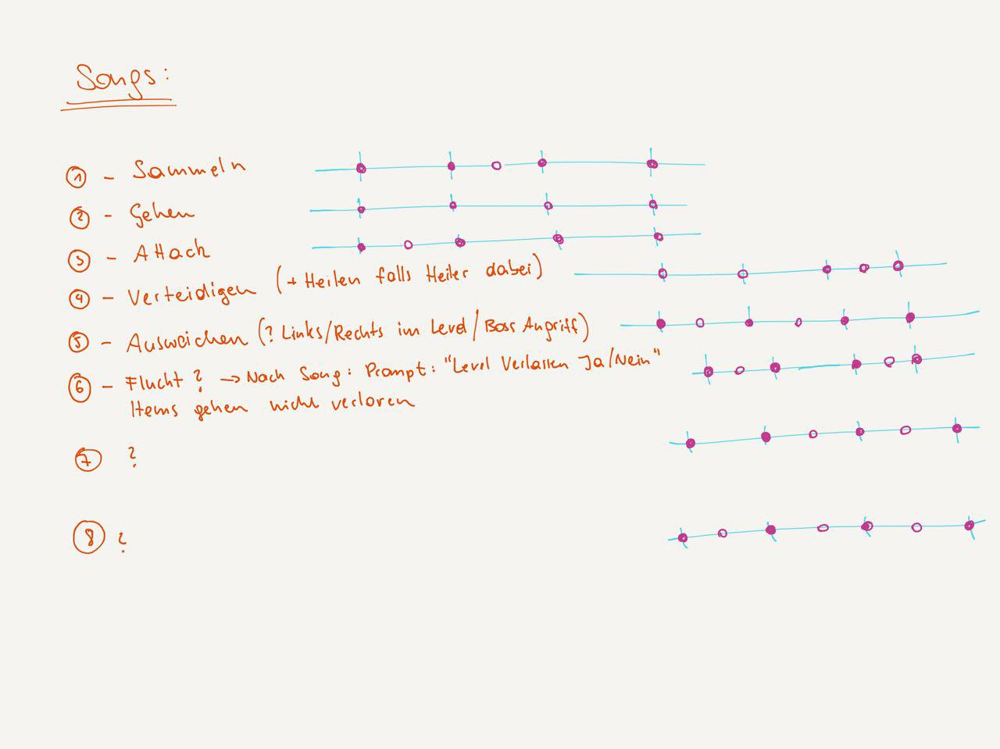
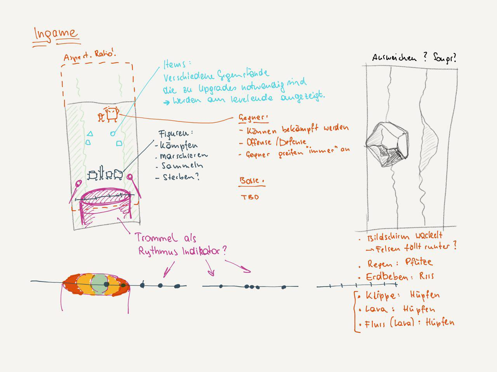
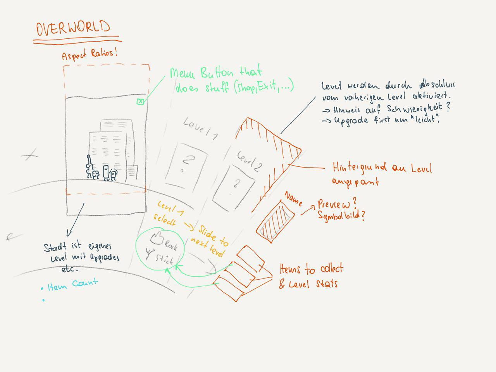

# The Rhythm Game

## Overview

### Theme / Setting / Genre
A rhythm game with strategic elements.

### Core gameplay mechanics brief
- Rhythmic commands
- Camp building
- Crafting and resource management

### Target platforms
- Android
- IOS
- UWP

### Monetization model
Ad driven, watch ad to get resources.
Progression enhancers via $$.

### Influences
#### Patapon
Main influencer. Hit different sounding drums in 4/4 beat to issue commands. React to boss monster prepared attacks (e.g. defend, run away) or attack enemy fortresses (with archers in towers). Commands like march, attack, defend, run away. Mainly sidescroller, but much off-meta gameplay as units can be equipped with weapons and upgraded, different unit types, ...
#### Guitar Hero
Forces you to hit notes accurately for streaks to get more points.
#### Don't Starve
Run through the overworld to collect stuff and craft items you need for progression.

### Elevator pitch
A game where the player controls a small group of units via drum beat songs to do specific tasks, like collect and fight. The player builds up a small camp which grows bigger after getting better resources.

### Project Description
Two drums with eyes show up on the screen, an old one (grey/white beard and eyebrows) and a young one. They talk in icon speechbubbles. The old one explains the young one how to make other instruments march (_march song_). The player has to play the song correctly a few times in a row. Finishing the tutorial loads the first level, where the player has to play the _march song_ multiple times to move the controlled characters through the level. 

~~They want to build a cottage, but first need wood. For wood, they need an axe. For an axe, they need sticks and stones. The little one isn't motivated, so the big one starts to drum. The player has to hit the screen in correct timing a few times to motivate the little one (_march song_, tutorial).~~

Finishing the first level triggers another tutorial: the _gather song_. Another song the old drum character teaches the young one. When played in the fields the controlled characters will collect resources that are currently visible on the screen.

~~Once he's motivated, a map view is shown and the player can select the "Fields". The level starts, a new song is learned (_gather song_). A field is shown with a few sticks and stones lying around. The formerly learned _march song_ moves the characters forward, the _gather song_ sends them to collect resources.~~

Consecutively playing songs correctly lets the characters collect more or move further. A level lasts for one day, so the level ends as the sun sets. Finishing a level unlocks the next one.

After each level the characters return to the overworld, which shows the camp and all currently available levels. In the camp, they can use the collected resources to craft tools like an axe which a character is able to equip, or later build new (instruments) characters, weapons and buildings.

After finishing the first level and crafting and equipping an axe, the player can visit the next level (forest) to get wood (a unit can chop wood if equipped with an axe with the gather song). In the forest, there are some smaller trees to chop (large ones can't be chopped) ~~, and they find another character. He joins their party after hearing their drums play a few correct beats~~. With the collected wood, the player can build a cottage in the camp to house more characters. However, to build more characters, they have to build an instrument maker's hut (requires more resources).

Getting better resources requires different equipment, which can be crafted using special buildings in the meta game. Collect wood and stones, craft pickaxes, get copper, build blacksmith etc...

## What sets this project apart?
- One button game
- Combination of crafting, building, rpg and rhythm game
- Procedural environments(?)

### Core gameplay mechanics

#### Rhythmic commands
##### Details
Tapping the screen in a specific rhythm will cause the players units to execute tasks. For every task, there's a song. The songs are: march, gather, attack, defend, dodge, retreat. The player plays a song in a 4/4 beat, then waits 4 beats and the units will "sing" the song and perform their tasks. If the player misses (or fails to jump in at the right time), the units trip.

##### How it works
Playing the songs correctly fills an internal _streak score_ bar. Depending on the quality of the beat hits, this bar is filled up quicker or slower. A miss resets it. If it's full, the _streak power_ is increased and all task executions are improved (e.g. gather more, move further, etc.) by 20% per _streak power_. To start playing a song, the player can just tap the screen once. A white border that flashes with each beat helps the player to jump in at the right time.

#### Camp building
##### Details
Camp buildings are built, used and upgraded during meta game. Resources are required to execute these actions. The longer the player plays, the higher the camp tier, the more and better resources are required. The camp can be used to house more units, upgrade them, equip them with items, craft new items, smelt ores, research advancements, build new characters and recap the previous mission (e.g. what resources were gathered, how did units progress, which areas have been unlocked).
##### How it works
The camp is displayed in a bird's eye view. New buildings can be built freely by tapping onto an empty space and selecting the building one want to build. If there are too many buildings, the view zooms out a bit to reveal more areas (maybe scrolling around is better, have to try...). In the beginning, only the cottage can be built. Later, research hut, instrument builder, blacksmith, hunter's hut, kitchen, training area and more follow. The buildings can be used to improve the units' performance on the field and enable new abilities when using the different songs.

#### Crafting & Resource Management
##### Details
The first thing the player wants to craft is an axe to chop wood. To be able to craft this, they need to collect sticks and stones. Some resources require units to wield special items, e.g. chopping wood requires a unit to wield an axe. Back in the camp, resources can be used to craft items. Crafting items requires different buildings although there are some starting items that can just be crafted "at the campfire" (like the axe).
##### How it works
Resources are collected during missions with the _gather song_. When selecting a mission on the world map, all known resource types are shown so the player knows which missions he has to complete to get certain resources. Unknown ones (e.g. not yet discovered because unable to obtain with the current equipment) are only shown when the necessary equipment is available. Missions that provide new kinds of resources because of new equipment technology are highlighted.

## Story and Gameplay
### Story (Brief)
The enemy: undead EDM music instruments
### Story (Detailed)
### Gameplay (Brief)
### Gameplay (Detailed)

## Assets Needed
### Graphics
#### UI
* Fonts
* Popup panels
* Buttons with text
* Buttons with icons
* * Yes/No or ✓/✘
* Equipment screens
* Squad selection screens
* Crafting screens
* TODO
#### Characters
* Old drum
* young drum
* violin
* recorder
* didgeridoo
* sax
* guitar
* boss (EDM subwoofer)
* TODO
#### Items
All items are spawned by mining their deposit, so each item also needs deposit graphics.
* stone
* stick
* birch tree
* rock
* coal ore
* beech tree
* iron ore
* oak tree
* copper ore
* TODO
#### Tools
We're starting with _Axe_ and _Pick_. All tools should have an icon representation as well as an ingame representation (attached to the equipping character), or a character decides on its own how its usage of the tool should look like:
* axe
* pick
* hands (no ingame representation)
* TODO
#### Weapons
See (Tools section)[#user-content-tools]
* sword
* bow
* spear
* shield
* staff (fire)
* staff (thunder)
* staff (ice)
* TODO
#### Levels
TODO: we haven't decided yet if we want to build the levels manually or just make an alternating background. Building them manually makes it easier to introduce scripted events (like falling rocks). We definitely need backgrounds though. Each level type should be reused, so there are multiple levels for each type (e.g. multiple forests, multiple grasslands, multiple mountains, etc).
* Grasslands level backgrounds
* forest level backgrounds
* mountain level backgrounds
* TODO
#### Overworld
* Camp state preview in variable progression
* 3 different grasslands previews
* 3 different forest previews
* 3 different mountain previews
* TODO
#### Tutorials
Tutorials look comic-like with multiple panels, showing the old and the young drum discussing new songs. While learning a song, there should be a little preview animation of a character executing the actual command when played successfully. Each song needs such a little comic:
* March
* Gather
* Attack
* Defend
* Dodge
* Retreat
#### Miscellaneous
* ingame beat indicators (drum with hit markers)

### Animations
#### Characters
* walk
* gather (depending on equipped tool: axe, pickaxe, hands)
* attack (depending on equipped weapon: shield, melee, ranged and magic)
* defend (depending on equipped weapon: shield, melee, ranged and magic)
* jump, dodge
* retreat
#### Effects
* falling rocks
* flowing water/lava
* crushing buildings
* magic attacks (heal, fire, lightning, ice)
* reached finish line
* TODO
#### Camp Buildings
* tool/weapon crafting
* build building
* create character
* research
* smelt ores
* upgrade characters
* TODO
#### Tutorials
* tutorial characters (whip with eyebrows, execute command)

### Sounds
#### Characters
Each character should have their own sound they make when the drum is hit, as well as one for each song there is, for each streak power value there is. Characters should also make sounds upon interaction with the world (being attacked, collected item, dying, ...).
* Successful drum hit
* Play song (min 6 clips per song)
* Get hit
* Die
* Collect item
* Win level
* Be upgraded
* Be picked in squad selection
#### Songs
Each song should have their own _ambient_ background, depending on current streak power.
* March
* Gather
* Attack
* Defend
* Dodge
* Retreat
#### Overworld
There should be an ambient background for the overworld, that slightly changes based on the setting of the current level section.
* Ambient (per level section)
#### UI
* Button sounds
* Window open/close
* Swipe overworld
* Equip tools/weapons 
#### Effects
* Weapon sounds (bow + flying arrow, swords hitting various things, blowtube darts, different magic wand casts/detonations)
* Resource gathering sounds (pickaxe hitting rock, axe hitting tree, ...)
#### Level Ambients
Each level type should have their own ambient sounds, e.g.
* Birds chirping (forest, fields),
* Falling rocks (volcano, mountains),
* Howling wind (cliffside, mountains),
* Waves breaking on the shore (beach, cliffside)

